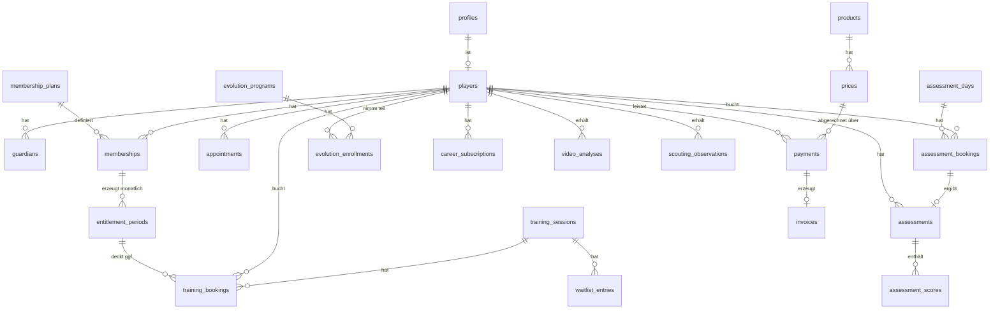

# Datenmodell — v0.1

**Projekt:** Player Development Platform (Arbeitstitel)
**Grundlage:** PRODUCT MASTER v1.0
**Plan-Woche:** 6 (vorgezogen)
**Datenbank:** PostgreSQL via Supabase

> Dieses Dokument ist die Vorlage für das spätere Datenbank-Schema. Es beschreibt **was** gespeichert wird und **welche Regeln die Datenbank selbst erzwingt** — nicht die konkrete SQL-Syntax.

---

## 1. Leitprinzip

Die kritischen Geschäftsregeln werden **in der Datenbank erzwungen**, nicht nur im Anwendungscode. Grund: Anwendungscode kann bei gleichzeitigen Zugriffen umgangen werden. Wenn zwei Spieler im selben Moment den letzten Torhüterplatz buchen, entscheidet die Datenbank — nicht der Zufall.

Konkret betrifft das vier Regeln:

| Regel | Wie erzwungen |
|---|---|
| Keine Überbuchung | Zählerspalten mit `CHECK`-Constraint auf der Session |
| Feldspieler belegen keine TW-Plätze | getrennte Zähler, Position wird bei der Buchung festgeschrieben |
| Kein Kontingent-Verbrauch über das Guthaben hinaus | `CHECK (verbraucht <= gesamt)` auf der Kontingentperiode |
| Nur ein aktives Membership je Spieler | eindeutiger Teilindex |

---

## 2. Überblick

---

## 3. Nutzer und Spieler

### `profiles`
Verknüpft mit Supabase `auth.users`. Ein Datensatz je Login.

| Feld | Typ | Anmerkung |
|---|---|---|
| `id` | uuid, PK | identisch mit `auth.users.id` |
| `role` | enum | `player` · `admin` |
| `email` | text | |
| `first_name`, `last_name` | text | |
| `phone` | text | optional |
| `created_at` | timestamptz | |

### `players`
Sportliches Profil. Ein Datensatz je Spieler.

| Feld | Typ | Anmerkung |
|---|---|---|
| `id` | uuid, PK | |
| `profile_id` | uuid, FK → profiles | |
| `date_of_birth` | date | steuert die Minderjährigen-Logik |
| `player_type` | enum | **`field` · `goalkeeper`** — steuert, welches Platzkontingent belegt wird |
| `position` | text | z. B. „Innenverteidiger" |
| `club` | text | |
| `team` | text | z. B. „U17" |
| `league` | text | Spielklasse |
| `strong_foot` | enum | `left` · `right` · `both` |
| `height_cm` | int | |
| `development_goals` | text | |
| `created_at` | timestamptz | |

> **`player_type` ist mehr als ein Profilfeld.** Es entscheidet bei jeder Buchung, welcher der beiden Zähler belegt wird. Ein Wechsel (Feldspieler wird Torhüter) darf bestehende Buchungen nicht rückwirkend verschieben — deshalb wird die Position **zum Buchungszeitpunkt in die Buchung kopiert**.

### `guardians`
Erziehungsberechtigte. Kein eigener Login in v1 (Annahme D2).

| Feld | Typ | Anmerkung |
|---|---|---|
| `id` | uuid, PK | |
| `player_id` | uuid, FK → players | |
| `first_name`, `last_name` | text | |
| `email`, `phone` | text | |
| `is_invoice_recipient` | bool | bei Minderjährigen Vertragspartner (D29) |
| `consent_given_at` | timestamptz | Zustimmung der Eltern |
| `photo_consent` | bool | Foto-/Videoeinwilligung |

---

## 4. Produkte, Preise, Steuer

Alle Preise liegen zentral — nirgends im Code hartkodiert. So ist der Wechsel in die Regelbesteuerung (P5) eine Datenänderung.

### `products`

| Feld | Typ | Anmerkung |
|---|---|---|
| `id` | uuid, PK | |
| `key` | text, unique | `training` · `online_session` · `video_analysis` · `scouting` · `assessment_individual` · `assessment_day` · `membership_bronze` · `membership_silver` · `membership_gold` · `evolution` · `evolution_repeat` · `career_support` |
| `name` | text | Anzeigename |
| `type` | enum | `one_time` · `subscription` |
| `active` | bool | |

### `prices`

| Feld | Typ | Anmerkung |
|---|---|---|
| `id` | uuid, PK | |
| `product_id` | uuid, FK → products | |
| `amount_cents` | int | **immer in Cent**, nie als Kommazahl |
| `currency` | text | `EUR` |
| `tax_rate` | numeric | `0.00` als Kleinunternehmer, später `0.19` |
| `tax_behavior` | enum | `inclusive` — Preise sind Endpreise (D39) |
| `audience` | enum | `standard` · `member_gold` — für den Spielsichtungs-Mitgliederpreis |
| `interval` | enum | `null` · `month` — bei Abos |
| `stripe_price_id` | text | Verknüpfung zu Stripe |
| `valid_from`, `valid_to` | timestamptz | Preishistorie, damit alte Rechnungen nachvollziehbar bleiben |

**Startdaten (v1.0):**

| Produkt | Betrag | audience |
|---|---|---|
| Training | 3.500 | standard |
| Online Session | 3.900 | standard |
| Videoanalyse | 14.900 | standard |
| Spielsichtung | 22.900 | standard |
| Spielsichtung | 18.900 | member_gold |
| Assessment Individual | 24.900 | standard |
| Assessment Day | 16.900 | standard |
| Bronze | 5.900 /Monat | standard |
| Silver | 12.900 /Monat | standard |
| Gold | 26.900 /Monat | standard |
| Evolution | 79.900 | standard |
| Evolution Repeat | 67.900 | standard |
| Evolution Rate | 27.900 × 3 | standard |
| Career Support | 9.900 /Monat | standard |

> **Preise nie als Fließkommazahl speichern.** `129.00 € ` als `float` führt zu Rundungsfehlern in der Buchhaltung. Immer Ganzzahl in Cent.

---

## 5. Membership und Kontingent

### `membership_plans`
Definiert, was eine Stufe monatlich enthält.

| Feld | Typ | Bronze | Silver | Gold |
|---|---|---|---|---|
| `key` | enum | `bronze` | `silver` | `gold` |
| `trainings_per_month` | int | 2 | 4 | 4 |
| `online_sessions_per_month` | int | 0 | 1 | 1 |
| `video_analyses_per_month` | int | 0 | 0 | 1 |
| `max_seats` | int | `null` | `null` | **10** (D31) |
| `product_id` | uuid | | | |

### `memberships`

| Feld | Typ | Anmerkung |
|---|---|---|
| `id` | uuid, PK | |
| `player_id` | uuid, FK → players | |
| `plan_id` | uuid, FK → membership_plans | |
| `status` | enum | `active` · `cancelled` · `ended` |
| `started_at` | date | |
| `cancelled_at` | timestamptz | Zeitpunkt der Kündigung |
| `ends_at` | date | immer Monatsletzter |
| `stripe_subscription_id` | text | |

**Regeln:**

- Ein Spieler hat **höchstens ein aktives Membership**. Erzwungen durch einen eindeutigen Teilindex auf `player_id` bei `status = 'active'`.
- Kündigung setzt `cancelled_at` und `ends_at` auf das Ende des laufenden Monats. Das Kontingent bleibt bis dahin nutzbar (D36).
- Ohne Kündigung verlängert sich das Membership automatisch — abgebildet über das Stripe-Abo.
- `max_seats` bei Gold: vor dem Anlegen wird geprüft, wie viele aktive Gold-Memberships existieren. Bei 10 ist der Kauf gesperrt.

### `entitlement_periods`
**Das Herzstück der Kontingentlogik.** Ein Datensatz je Membership und Kalendermonat.

| Feld | Typ | Anmerkung |
|---|---|---|
| `id` | uuid, PK | |
| `membership_id` | uuid, FK → memberships | |
| `period_start` | date | immer der 1. des Monats |
| `period_end` | date | immer der Monatsletzte |
| `trainings_total` | int | aus dem Plan kopiert |
| `trainings_used` | int | Startwert 0 |
| `online_sessions_total` / `_used` | int | |
| `video_analyses_total` / `_used` | int | |

**Regeln:**

- `CHECK (trainings_used <= trainings_total)` — analog für die anderen beiden. Damit ist ein Verbrauch über das Guthaben hinaus **technisch unmöglich**, unabhängig vom Anwendungscode.
- Eindeutig je `(membership_id, period_start)` — keine doppelten Perioden.
- Eine geplante Aufgabe legt am Monatsersten für jedes aktive Membership die neue Periode an. Ungenutzte Einheiten der Vormonatsperiode **verfallen dadurch automatisch** — sie werden nicht übertragen, die alte Periode bleibt nur als Historie stehen.
- Werte werden aus dem Plan **kopiert, nicht referenziert**. Ändert sich der Plan später, gelten für laufende Perioden weiter die alten Werte.

---

## 6. Trainings und Buchungen

### `training_sessions`

| Feld | Typ | Anmerkung |
|---|---|---|
| `id` | uuid, PK | |
| `starts_at` | timestamptz | |
| `duration_minutes` | int | Standard 60 |
| `location` | text | |
| `field_capacity` | int | Standard **8** |
| `gk_capacity` | int | Standard **2** |
| `field_booked` | int | Zähler, Start 0 |
| `gk_booked` | int | Zähler, Start 0 |
| `price_id` | uuid, FK → prices | |
| `status` | enum | `scheduled` · `cancelled` · `completed` |
| `cancellation_reason` | text | bei Ausfall durch dich (D23) |

**Regeln:**

- `CHECK (field_booked >= 0 AND field_booked <= field_capacity)`
- `CHECK (gk_booked >= 0 AND gk_booked <= gk_capacity)`

> **So wird Überbuchung ausgeschlossen:** Buchung und Zählererhöhung laufen in **einer** Transaktion. Versuchen zwei Spieler gleichzeitig den letzten Platz, verletzt die zweite Transaktion den `CHECK` und wird von der Datenbank abgewiesen. Der zweite Spieler bekommt eine saubere Fehlermeldung und das Angebot, auf die Warteliste zu gehen. Es gibt keine Race Condition, die man „übersehen" kann.

**Abgeleitete Fristen** (nicht gespeichert, berechnet):

- Buchungsschluss: `starts_at − 2 Stunden`
- Stornoschluss: `starts_at − 24 Stunden`

### `training_bookings`

| Feld | Typ | Anmerkung |
|---|---|---|
| `id` | uuid, PK | |
| `session_id` | uuid, FK → training_sessions | |
| `player_id` | uuid, FK → players | |
| `booked_as` | enum | **`field` · `goalkeeper`** — zum Buchungszeitpunkt kopiert |
| `status` | enum | `confirmed` · `cancelled_in_time` · `cancelled_late` · `no_show` |
| `entitlement_period_id` | uuid, FK, nullable | gesetzt, wenn aus Kontingent gedeckt |
| `payment_id` | uuid, FK, nullable | gesetzt, wenn bezahlt (Einzelbuchung oder Nachkauf) |
| `booked_at` | timestamptz | |
| `cancelled_at` | timestamptz | |

**Regeln:**

- Genau eine Deckungsquelle: `CHECK` darauf, dass entweder `entitlement_period_id` **oder** `payment_id` gesetzt ist, nie beides und nie keines.
- Eindeutig je `(session_id, player_id)` bei `status = 'confirmed'` — niemand bucht denselben Termin zweimal.
- **Storno in Frist** (> 24 h): Zähler auf der Session wird verringert, Kontingent zurückgebucht (`trainings_used − 1`), Warteliste rückt nach.
- **Storno nach Frist oder No-Show**: Zähler wird verringert, damit der Platz frei wird — **das Kontingent wird aber nicht zurückgebucht** (`trainings_used` bleibt). Eine bezahlte Einzelbuchung wird nicht erstattet. Genau das ist die Regel aus Product Master 3.3.

### `waitlist_entries`

| Feld | Typ | Anmerkung |
|---|---|---|
| `id` | uuid, PK | |
| `session_id` | uuid, FK | |
| `player_id` | uuid, FK | |
| `waitlist_for` | enum | `field` · `goalkeeper` — getrennte Wartelisten |
| `position` | int | |
| `created_at` | timestamptz | |
| `notified_at` | timestamptz | |

Wird ein Platz frei, rückt der erste Eintrag der passenden Warteliste nach — automatisch bis 2 h vor Beginn (D37). Der Benachrichtigungstext weist darauf hin, dass innerhalb der 24-Stunden-Frist keine Stornierung mehr möglich ist.

---

## 7. Einzeltermine

### `appointments`
Alle 1:1-Termine in einer Tabelle — sie unterscheiden sich nur im Typ, nicht in der Struktur.

| Feld | Typ | Anmerkung |
|---|---|---|
| `id` | uuid, PK | |
| `player_id` | uuid, FK → players | |
| `type` | enum | `online_session` · `video_analysis_debrief` · `scouting_debrief` · `career_call` · `career_review` · `evolution_feedback` |
| `starts_at` | timestamptz | |
| `duration_minutes` | int | |
| `meeting_url` | text | Zoom-Link |
| `status` | enum | `scheduled` · `completed` · `cancelled` |
| `entitlement_period_id` | uuid, FK, nullable | |
| `payment_id` | uuid, FK, nullable | |
| `notes` | text | deine internen Notizen |

---

## 8. Assessment

### `assessment_days`

| Feld | Typ | Anmerkung |
|---|---|---|
| `id` | uuid, PK | |
| `date` | date | max. 1 pro Monat |
| `starts_at` | timestamptz | |
| `location` | text | |
| `capacity` | int | |
| `booked` | int | Zähler mit `CHECK (booked <= capacity)` |
| `price_id` | uuid, FK → prices | **Fixpreis, beim Anlegen gesetzt** (P3) |

### `assessment_bookings`

| Feld | Typ |
|---|---|
| `id` | uuid, PK |
| `assessment_day_id` | uuid, FK |
| `player_id` | uuid, FK |
| `payment_id` | uuid, FK |
| `status` | enum: `confirmed` · `cancelled` · `completed` |

### `assessments`
Das Ergebnis — unabhängig davon, ob aus Assessment Day oder Individual Assessment.

| Feld | Typ | Anmerkung |
|---|---|---|
| `id` | uuid, PK | |
| `player_id` | uuid, FK | |
| `source` | enum | `assessment_day` · `individual` · `re_assessment` |
| `assessment_day_id` | uuid, FK, nullable | |
| `conducted_on` | date | |
| `is_reassessment_of` | uuid, FK, nullable | verweist auf das Erst-Assessment — so wird Fortschritt vergleichbar |
| `summary` | text | |
| `published_at` | timestamptz | erst dann für den Spieler sichtbar |

### `assessment_scores`
Einzelwerte. Bewusst flexibel gehalten, weil die Testkategorien noch offen sind (D7).

| Feld | Typ | Anmerkung |
|---|---|---|
| `assessment_id` | uuid, FK | |
| `category` | text | z. B. „Technik", „Schnelligkeit" |
| `metric` | text | z. B. „Passgenauigkeit" |
| `value` | numeric | |
| `unit` | text | z. B. `sec`, `punkte` |
| `scale_min`, `scale_max` | numeric | für die Darstellung als Balken |

> Sobald D7 beantwortet ist, wird daraus eine feste Kategorienliste. Bis dahin bleibt die Struktur offen — das kostet nichts und verhindert, dass wir uns auf falsche Kategorien festlegen.

---

## 9. Evolution, Career, Analysen

### `evolution_programs` (Kohorte)

| Feld | Typ | Anmerkung |
|---|---|---|
| `id` | uuid, PK | |
| `name` | text | „12 Week Evolution #01" |
| `starts_on`, `ends_on` | date | 12 Wochen |
| `capacity` | int | 6 |
| `booked` | int | mit `CHECK` |

### `evolution_enrollments`

| Feld | Typ | Anmerkung |
|---|---|---|
| `id` | uuid, PK | |
| `program_id`, `player_id` | uuid, FK | |
| `is_repeat` | bool | steuert 679 € statt 799 € |
| `payment_mode` | enum | `full` · `installments` |
| `trainings_total` / `_used` | int | 12 |
| `online_sessions_total` / `_used` | int | 3 |
| `analysis_done`, `reassessment_done`, `feedback_done` | bool | |

Ein Spieler darf **höchstens zweimal** teilnehmen (einmal regulär, einmal als Repeat) — als Constraint abgebildet.

### `career_subscriptions`

| Feld | Typ | Anmerkung |
|---|---|---|
| `id` | uuid, PK | |
| `player_id` | uuid, FK | |
| `status` | enum | `active` · `cancelled` · `ended` |
| `started_on` | date | |
| `minimum_term_ends_on` | date | `started_on + 12 Monate` |
| `cancelled_at`, `ends_on` | | nach Mindestlaufzeit monatlich kündbar |
| `anamnesis_done_at` | timestamptz | |
| `stripe_subscription_id` | text | |

Vor `minimum_term_ends_on` ist eine Kündigung nur zum Ende der Mindestlaufzeit möglich; danach zum Monatsende. Das ist die gesetzliche Vorgabe aus P4.

### `video_analyses` und `scouting_observations`

| Feld | Typ | Anmerkung |
|---|---|---|
| `id` | uuid, PK | |
| `player_id` | uuid, FK | |
| `match_date`, `opponent` | | bei Spielsichtung |
| `video_url` | text | bei Videoanalyse |
| `status` | enum | `requested` · `in_progress` · `completed` |
| `debrief_appointment_id` | uuid, FK → appointments | die 30-Min.-Nachbesprechung |
| `entitlement_period_id` / `payment_id` | uuid, FK, nullable | Gold-Kontingent oder Kauf |
| `report` | text | |

---

## 10. Zahlungen und Rechnungen

### `payments`

| Feld | Typ | Anmerkung |
|---|---|---|
| `id` | uuid, PK | |
| `player_id` | uuid, FK | |
| `price_id` | uuid, FK | |
| `amount_cents` | int | tatsächlich gezahlter Betrag |
| `tax_rate`, `tax_amount_cents` | | **zum Zahlungszeitpunkt eingefroren** |
| `status` | enum | `pending` · `succeeded` · `failed` · `refunded` |
| `stripe_payment_intent_id` | text | |
| `paid_at` | timestamptz | |

### `installment_plans` und `installments`
Für die Evolution-Ratenzahlung (3 × 279 €). Jede Rate wird als eigene `payment` geführt, damit die Buchhaltung stimmt.

### `invoices`

| Feld | Typ | Anmerkung |
|---|---|---|
| `id` | uuid, PK | |
| `payment_id` | uuid, FK | |
| `recipient_type` | enum | `player` · `guardian` (D29) |
| `lexware_invoice_id` | text | |
| `invoice_number` | text | von Lexware vergeben |
| `pdf_url` | text | |
| `synced_at` | timestamptz | |
| `sync_error` | text | für den Fall, dass Lexware nicht erreichbar ist |

> **Rechnungsnummern kommen ausschließlich von Lexware Office.** Eigene Nummernkreise wären ein GoBD-Risiko. `sync_error` sorgt dafür, dass eine fehlgeschlagene Übertragung sichtbar bleibt statt still zu verschwinden — sonst fehlen am Jahresende Rechnungen.

---

## 11. Was die Datenbank zusätzlich erzwingt

| # | Regel | Mechanismus |
|---|---|---|
| 1 | Keine Überbuchung Feldspieler/Torhüter | `CHECK` auf Zählerspalten, Transaktion |
| 2 | Kein Kontingent-Verbrauch über Guthaben | `CHECK (used <= total)` |
| 3 | Nur ein aktives Membership je Spieler | eindeutiger Teilindex |
| 4 | Max. 10 aktive Gold-Memberships | Prüfung vor Anlage, `max_seats` |
| 5 | Keine Doppelbuchung desselben Termins | eindeutiger Teilindex auf `(session_id, player_id)` |
| 6 | Jede Buchung genau eine Deckungsquelle | `CHECK` auf Kontingent **oder** Zahlung |
| 7 | Max. 2 Evolution-Teilnahmen je Spieler | Constraint auf `evolution_enrollments` |
| 8 | Spieler sehen nur ihre eigenen Daten | Row Level Security auf allen Tabellen |

**Row Level Security** ist dabei nicht optional: Ohne sie könnte ein technisch versierter Nutzer über die API die Daten anderer Spieler abrufen — bei Minderjährigen ein ernsthaftes Datenschutzproblem. Jede Tabelle bekommt eine Regel „Spieler sieht nur eigene Zeilen, Admin sieht alles".

---

## 12. Offene Punkte für dieses Dokument

| Nr. | Frage | Auswirkung auf das Modell |
|---|---|---|
| D7 | Testkategorien Assessment | `assessment_scores` bleibt so lange flexibel |
| D2 | Eltern mit eigenem Login? | derzeit nein — bei „ja" bekommt `guardians` ein `profile_id` |
| D38 | Umfang Videoanalyse | nur Zeitplanung, keine Strukturänderung |
| D23 | Ausfall durch dich | entscheidet, ob Kontingent zurückgebucht oder gutgeschrieben wird |
| D26 | Weitere Trainer | derzeit nur Rolle `admin`; bei „ja" käme `coach` mit eingeschränkten Rechten dazu |

---

## 13. Nächster Schritt

1. **Stripe-Produktstruktur** — alle Produkte, Preise, Abos und Ratenpläne aus Abschnitt 4 (Plan-Woche 12)
2. **Website-Seitenstruktur** mit echten Preisen und Vergleichstabelle (Plan-Woche 5)
3. Danach technisches Setup: Next.js, Supabase, dieses Schema als Migration (Plan-Woche 6)
